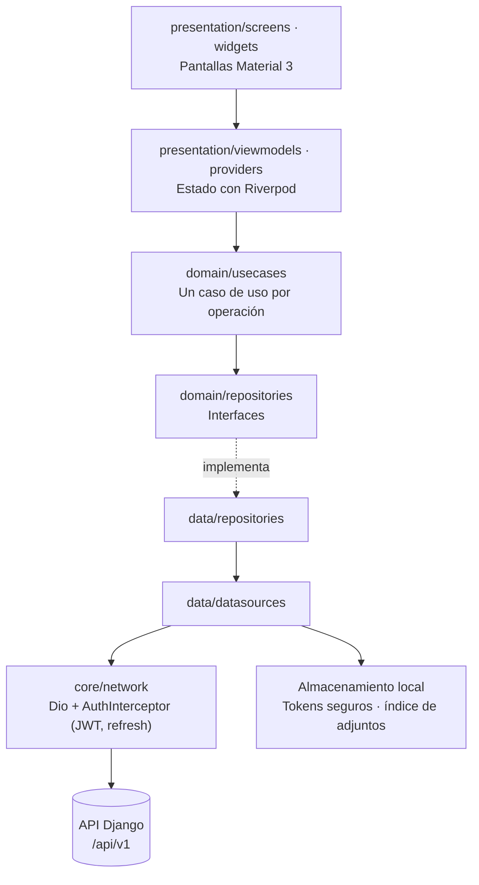

# TodoApp Flutter

[](https://github.com/jhurtadojerves/todoapp-flutter/actions/workflows/flutter.yml)
[](https://github.com/jhurtadojerves/todoapp-flutter/actions/workflows/release-apk.yml)

Aplicación móvil para gestionar tareas en equipo: tableros con miembros, estados,
sprints, tareas, comentarios y fotos de evidencia con ubicación. Se conecta a una
API REST en Django protegida con JWT. Es la migración a Flutter de una app
React Native/Expo. Android es la plataforma principal; iOS está configurado, pero
requiere macOS para compilar. 

**Descargar:** el APK firmado de cada versión está en
[Releases](https://github.com/jhurtadojerves/todoapp-flutter/releases/latest).
Apunta al backend de producción `https://todoapp.juliens.dev`.

## Contenido

- [Requisitos](#requisitos)
- [Ejecutar en desarrollo](#ejecutar-en-desarrollo)
- [Configuración por ambiente](#configuración-por-ambiente)
- [Pruebas](#pruebas)
- [Compilar la versión de publicación](#compilar-la-versión-de-publicación)
- [Integración y despliegue continuos](#integración-y-despliegue-continuos)
- [Arquitectura](#arquitectura)
- [Estructura de carpetas](#estructura-de-carpetas)
- [API del backend](#api-del-backend)
- [Documentación](#documentación)

## Requisitos

| Herramienta | Versión |
|---|---|
| Flutter | 3.44.5 (canal stable) |
| Dart | 3.12.2 (incluido con Flutter) |
| Android Studio | Con Android SDK (API 36) y su JDK 17 |
| Emulador o teléfono Android | Android 7.0 (API 24) o superior |
| Backend Django | Local en el puerto 8080, o el de producción |

Las versiones exactas de las dependencias están fijadas en `pubspec.lock`.

## Ejecutar en desarrollo

```powershell
git clone https://github.com/jhurtadojerves/todoapp-flutter.git
cd todoapp-flutter
flutter pub get
dart run build_runner build          # genera código de Freezed, JSON y Riverpod
flutter run --dart-define-from-file=env/dev.json
```

`env/dev.json` apunta a `http://10.0.2.2:8080`, que es como el **emulador**
Android llega al `localhost` de tu PC. El backend Django tiene que estar
corriendo en el puerto 8080.

**En un teléfono conectado por USB**, `10.0.2.2` no existe. Redirige el puerto y
usa un archivo local (Git lo ignora):

```powershell
adb reverse tcp:8080 tcp:8080
'{"API_BASE_URL":"http://127.0.0.1:8080","API_TIMEOUT_MS":15000}' | Set-Content env/dev-device.json
flutter run --dart-define-from-file=env/dev-device.json
```

**Contra producción**, sin backend local:
`flutter run --dart-define-from-file=env/prod.json`.

## Configuración por ambiente

La configuración se pasa en tiempo de compilación con `--dart-define-from-file`
y queda embebida en la app. Por eso **nunca debe contener secretos**.

| Variable | Descripción | `env/dev.json` | `env/prod.json` |
|---|---|---|---|
| `API_BASE_URL` | URL base de la API, sin `/api/v1` | `http://10.0.2.2:8080` | `https://todoapp.juliens.dev` |
| `API_TIMEOUT_MS` | Tiempo máximo de conexión, envío y respuesta | `15000` | `15000` |

La app valida `API_BASE_URL` al arrancar. En release solo acepta HTTPS. HTTP se
permite únicamente para `10.0.2.2`, `localhost` y `127.0.0.1` en desarrollo.

## Pruebas

```powershell
flutter test                     # unitarias, widget e integración de pantallas (144 tests)
flutter test --coverage          # igual, con reporte en coverage/lcov.info
flutter analyze                  # análisis estático
dart format --output=none --set-exit-if-changed lib test integration_test
```

Pruebas que requieren dispositivo:

```powershell
# Integración nativa (emulador encendido)
flutter test integration_test/smoke_test.dart -d emulator-5554 --dart-define-from-file=env/dev.json

# End-to-end con Maestro (APK instalado + backend de pruebas; no usar producción)
maestro test -e E2E_EMAIL=cuenta-de-pruebas -e E2E_PASSWORD=clave-de-pruebas .maestro/flows
```

La [guía de pruebas](docs/TESTING_GUIDE.md) explica cada tipo de prueba, enlaza
los tests más representativos y cubre la depuración.

## Compilar la versión de publicación

Requiere configurar la firma una vez: el keystore y `android/key.properties`,
ambos fuera del control de versiones. El paso a paso está en
[BUILD_APK.md](BUILD_APK.md).

```powershell
flutter build apk --release --dart-define-from-file=env/prod.json
# → build/app/outputs/flutter-apk/app-release.apk
```

Sin `android/key.properties`, el build release falla con un mensaje claro:
nunca firma con la clave de debug. Para publicar en Google Play se usa
`flutter build appbundle` en lugar de `apk`.

## Integración y despliegue continuos

| Workflow | Se ejecuta con | Qué hace |
|---|---|---|
| [`flutter.yml`](.github/workflows/flutter.yml) | Push a `main` y pull requests | Formato, análisis, tests y cobertura |
| [`release-apk.yml`](.github/workflows/release-apk.yml) | Publicar un release | Tests, compilación firmada con `env/prod.json` y APK adjunto al release |

Para publicar una versión nueva:

```powershell
gh release create v1.1.0 --title "v1.1.0" --generate-notes
```

El tag define el nombre de versión (`1.1.0`) y el número de ejecución del
workflow define el número de compilación. La firma vive en GitHub Secrets
(ver [BUILD_APK.md](BUILD_APK.md#apk-automático-en-releases)).

## Arquitectura

Arquitectura por capas (Clean Architecture) con Riverpod para el estado:



- **`core/network`** centraliza los errores: cada respuesta se traduce a
  `ApiError` (4xx con el mensaje del backend) o `ServerError` (5xx, timeouts o
  un contrato roto). `AuthInterceptor` renueva el token una sola vez aunque
  fallen varias peticiones a la vez, y cierra la sesión si el refresh falla.
- **Modelos** inmutables con Freezed, agrupados en `lib/domain/models/models.dart`.
  El JSON remoto usa `snake_case`. Tras cambiar un modelo, ejecuta `build_runner`.
- **Cámara y GPS** están detrás de interfaces (`core/device`), así que en los
  tests se sustituyen por fakes. Las fotos se copian a almacenamiento local de
  la app con un índice JSON.

## Estructura de carpetas

```
├── lib/
│   ├── app/            # router (go_router) y tema
│   ├── core/           # red, errores, configuración, almacenamiento, dispositivo
│   ├── domain/         # modelos, interfaces de repositorio y casos de uso
│   ├── data/           # datasources remotos/locales e implementaciones
│   └── presentation/   # pantallas, widgets, viewmodels y providers
├── test/               # unitarias (test/unit), widget e integración de pantallas
├── integration_test/   # prueba nativa en emulador/dispositivo
├── .maestro/           # flujos end-to-end
├── env/                # configuración por ambiente (dev, prod)
├── android/ · ios/     # proyectos nativos
├── docs/               # guía de pruebas y documentación de la migración
└── .github/workflows/  # CI y releases
```

## API del backend

El backend publica su especificación **OpenAPI 3.0** en
[`https://todoapp.juliens.dev/api/schema/`](https://todoapp.juliens.dev/api/schema/).
Todas las rutas cuelgan de `/api/v1/`, se autentican con
`Authorization: Bearer <access>` y el token se obtiene en
`POST /api/v1/auth/token/`.

## Documentación

| Documento | Para qué sirve |
|---|---|
| [BUILD_APK.md](BUILD_APK.md) | Compilación, dispositivos, firma, releases automáticos e iOS |
| [docs/TESTING_GUIDE.md](docs/TESTING_GUIDE.md) | Tipos de pruebas, ejemplos, comandos y depuración |
| [docs/migration/MIGRATION_PROGRESS.md](docs/migration/MIGRATION_PROGRESS.md) | Estado real del proyecto, verificaciones y pendientes |
| [docs/migration/MIGRATION_PLAN.md](docs/migration/MIGRATION_PLAN.md) | Alcance y criterios de aceptación de la migración |
| [docs/migration/MIGRATION_HISTORY.md](docs/migration/MIGRATION_HISTORY.md) | Bitácora cronológica del trabajo |
| [.maestro/README.md](.maestro/README.md) | Cómo ejecutar los flujos end-to-end |

> **Estado:** la app está implementada, probada y distribuida (v1.0.0), pero la
> migración no está cerrada. Falta la validación funcional en un dispositivo
> contra el backend real y la comparación completa con la suite original de
> React Native. Ver [MIGRATION_PROGRESS.md](docs/migration/MIGRATION_PROGRESS.md).
